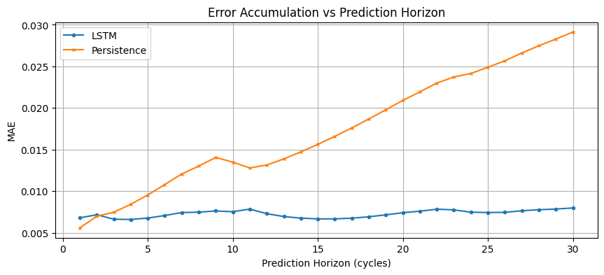
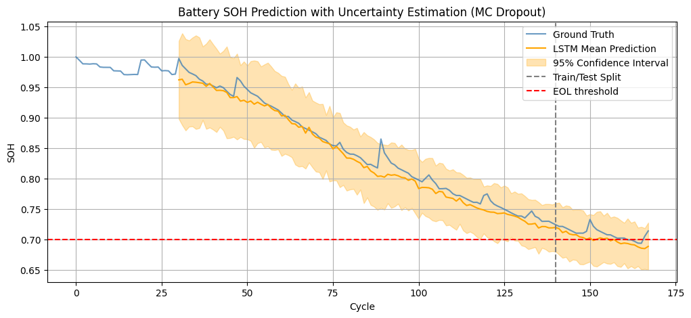
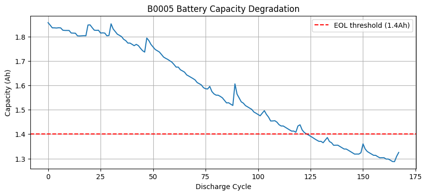
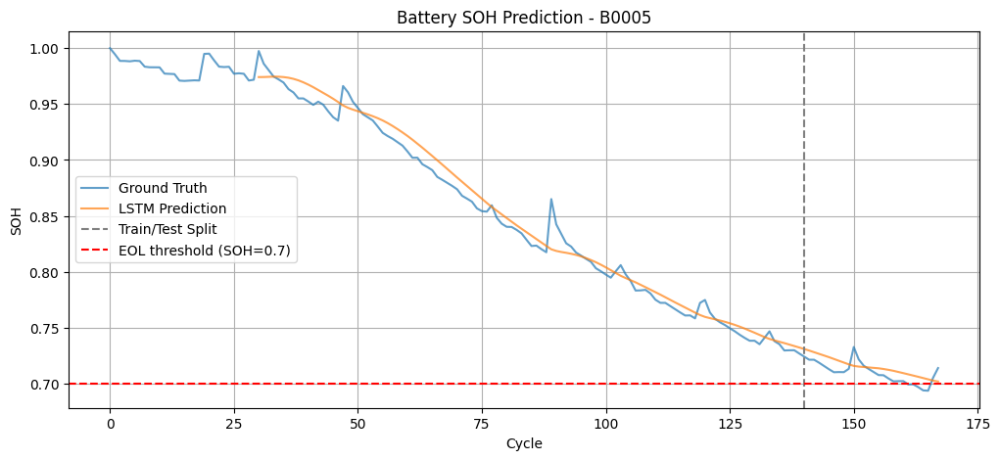

# Battery Degradation Modeling with LSTM: Rollout Stability and Uncertainty Analysis

Predicting lithium-ion battery **State of Health (SOH)** and **Remaining Useful Life (RUL)** using LSTM-based sequence modeling, with a focus on long-horizon prediction stability and uncertainty quantification.

## Motivation

Accurate SOH/RUL estimation matters for predictive maintenance, battery safety, and lifecycle management in Battery Management Systems (BMS). The core difficulty is that autoregressive models accumulate errors over long rollouts, and small per-step mistakes compound into large drift at extended horizons.

This project looks at that problem directly, applying findings from [rnn-lstm-sequence-prediction](https://github.com/UNICODEY/rnn-lstm-sequence-prediction) to a real battery degradation scenario.

---

## Results

| Model | MAE | RMSE |
|-------|-----|------|
| Persistence | 0.0036 | 0.0056 |
| Linear Regression | 0.0030 | 0.0056 |
| MLP | 0.0873 | 0.0882 |
| **LSTM (ours)** | **0.0079** | **0.0086** |

**RUL prediction error: 6 cycles out of 161 total (3.7%)**

Simple baselines outperform LSTM at short horizons. LSTM's advantage becomes clear at extended prediction horizons. See rollout analysis below.

---

## Key Findings

### 1. Rollout Stability: LSTM vs Persistence

| Horizon | LSTM MAE | Persistence MAE |
|---------|----------|-----------------|
| 1 cycle | 0.0068 | 0.0056 |
| 10 cycles | 0.0075 | 0.0135 |
| 30 cycles | 0.0080 | 0.0291 |



At short horizons, naive baselines are competitive. As prediction horizon grows, persistence error increases roughly linearly while LSTM error stays flat, a 3.6x advantage at horizon 30. This is consistent with the compounding error hypothesis studied in autoregressive sequence modeling.

### 2. Multivariate Features: A Negative Result

Adding voltage, current, and temperature features (6-dimensional input) increased MAE from 0.0079 to 0.0274. With only 110 training samples, aggregating raw signals into per-cycle statistics (mean, min) loses too much temporal detail. More features did not help here, and feature engineering quality mattered more than feature quantity.

### 3. Uncertainty Estimation

Monte Carlo Dropout outputs a mean prediction and confidence interval at each step. Uncertainty is higher in early cycles where degradation patterns are less stable, and decreases as the battery approaches EOL where the curve becomes more regular. In real BMS applications, knowing how reliable a prediction is matters as much as the prediction itself.



---

## Method

**Dataset:** NASA Li-ion Battery Aging Dataset (B0005)
- 168 discharge cycles, capacity fade from 2 Ah to 1.4 Ah (EOL at 30% fade)

**Pipeline:**
1. Extract per-cycle discharge capacity and compute SOH
2. Build sliding window dataset (window = 30 cycles)
3. Train 2-layer LSTM (hidden size 64, dropout 0.2)
4. Compare against persistence, linear regression, and MLP baselines
5. Rollout horizon analysis: measure MAE at horizons 1 to 30
6. Multivariate experiment: add voltage, current, and temperature features
7. Uncertainty estimation via Monte Carlo Dropout (100 forward passes)

---

## Visualizations

| Capacity Degradation | SOH Prediction |
|---|---|
|  |  |

| Rollout Error | Uncertainty Band |
|---|---|
|  |  |

---

## Usage

1. Download the [NASA Battery Dataset](https://data.nasa.gov/dataset/Li-ion-Battery-Aging-Datasets/uj5r-zjdb)
2. Upload `5.+Battery+Data+Set.zip` to Google Drive
3. Open `battery_soh_prediction.ipynb` in Google Colab
4. Run all cells sequentially

**Requirements:**
```
torch
scipy
numpy
matplotlib
scikit-learn
```

---

## Related Work

- [RNN/LSTM Sequence Prediction Stability](https://github.com/UNICODEY/rnn-lstm-sequence-prediction): compounding error analysis, teacher forcing vs free rollout, latent space prediction with an RSSM-inspired architecture
